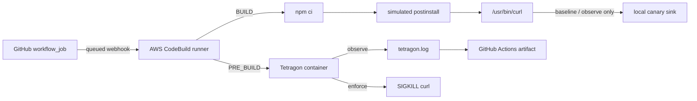

# tetragon-codebuild-guard

Run GitHub Actions jobs on AWS CodeBuild and use Tetragon to observe and stop a
simulated compromised npm dependency.

Tetragon is a runtime security tool, not a CVE scanner. This proof of concept
tests whether an eBPF-based policy can detect a connection from an npm
`postinstall` script and terminate the process making it.

> **Note:** This is an experiment with eBPF and BTF support in CodeBuild's
> managed environment, not a production security boundary. Availability can
> vary with the host kernel and environment configuration. If Tetragon cannot
> start, the workflow reports the failure and saves diagnostics.

## What the demo tests

The same simulated attack runs in three modes. Tetragon runs in all three.

| Mode       | TracingPolicy | npm lifecycle script | Canary received | Expected demo policy events |
| ---------- | ------------- | -------------------- | --------------- | --------------------------- |
| `baseline` | Not loaded    | Succeeds             | Yes             | No connection events        |
| `observe`  | Monitor       | Succeeds             | Yes             | Matching connection event   |
| `enforce`  | Enforce       | Fails with SIGKILL   | No              | Matching connection event   |

The application in `demo/victim` depends on the local package in
`demo/compromised-dependency`. Installing it with `npm ci` runs the dependency's
`postinstall` script, which invokes `/usr/bin/curl` to send a fixed dummy value
(the canary).

A temporary Node.js HTTP server in the same CodeBuild runner receives the
request. The demo uses the runner's non-loopback IPv4 address so the connection
matches the policy. It does not send data to an Internet collection endpoint,
use real credentials, or test Internet exfiltration. The receipt stores the
canary's SHA-256 hash, not its contents.

## Architecture



CodeBuild starts Tetragon in `PRE_BUILD`, before the GitHub Actions runner starts
in `BUILD`. In `POST_BUILD`, it collects daemon logs and stops Tetragon.
The workflow needs the `buildspec-override:true` runner label to enable these
buildspec phases.

The build image and host kernel are separate settings. This stack uses the
Amazon Linux 2023 image and explicitly sets
`Environment.HostKernel: LINUX_KERNEL_6`. Selecting the AL2023 image alone did
not provide BTF in our initial run on a Linux 4.14 host. The successful run used
Linux 6.1 with BTF available at `/sys/kernel/btf/vmlinux`; Linux 6.1 is the
validated environment here, not Tetragon's minimum kernel requirement.

Tetragon uses BTF type information to adapt its eBPF programs to the running
kernel. This container-based setup also enables privileged mode so Tetragon
can load and attach those programs.

See the [validation notes from September 20, 2026](docs/aws-validation-2026-09-20.md)
(in Japanese) for the measured results and evidence links.

## AWS resources

The application stack creates:

- A CodeBuild project named `tetragon-codebuild-guard`.
- A CodeBuild IAM role with access to write CloudWatch Logs and, when supplied,
  use the specified CodeConnections connection.
- A CloudWatch Logs group at `/aws/codebuild/tetragon-codebuild-guard`, with
  seven-day retention.

The application stack does not create a VPC, NAT Gateway, EKS cluster, or S3
bucket. CDK bootstrapping creates its own supporting resources separately.

## Prerequisites

- An AWS account with permission to deploy the stack.
- Node.js 22.12 or later.
- pnpm 10.11.0, matching `packageManager` in `package.json`.
- The AWS CLI, configured for the target account and Region.
- A GitHub repository.
- A bootstrapped CDK environment in the target account and Region, or permission
  to bootstrap it in step 4.
- An AWS CodeConnections connection for GitHub in the `AVAILABLE` state.

Complete GitHub App authorization in the AWS console. See the
[AWS connection setup guide](https://docs.aws.amazon.com/codebuild/latest/userguide/connections-github-app.html).

## Setup

### 1. Push the repository to GitHub

Push this project to the GitHub repository that will run the workflow.
The demo only enables `workflow_dispatch`; pushes and pull requests from
external forks do not automatically run it.

### 2. Create the CodeConnections connection

If you do not already have a connection, create one and complete the GitHub
App setup in the AWS console:

```bash
aws codeconnections create-connection \
  --provider-type GitHub \
  --connection-name tetragon-codebuild-guard
```

Save the returned ARN. A connection that is still `PENDING` cannot be used to
create the repository webhook during deployment.

Authorizing the GitHub App and installing it are separate steps. An
`AVAILABLE` connection alone does not prove the App has repository access.

1. Install [AWS Connector for GitHub](https://github.com/apps/aws-connector-for-github).
2. Choose `Only select repositories` and grant access to the demo repository.
3. Check `Settings > Applications > Installed GitHub Apps` in GitHub.
4. Select the correct App installation when completing the AWS connection setup,
   and confirm that the connection is `AVAILABLE`.

### 3. Install dependencies and verify the project

```bash
corepack enable
pnpm install --frozen-lockfile
pnpm verify
```

`pnpm verify` runs formatting checks, ESLint, TypeScript checks, unit tests, and
CDK synthesis.

### 4. Deploy to AWS

Skip the bootstrap command if the target account and Region are already
bootstrapped.

```bash
pnpm exec cdk bootstrap

pnpm exec cdk deploy \
  -c githubOwner=YOUR_GITHUB_OWNER \
  -c githubRepo=tetragon-codebuild-guard \
  -c githubConnectionArn=YOUR_CONNECTION_ARN
```

You can omit `githubConnectionArn` if suitable GitHub credentials are already
registered with CodeBuild in the target account and Region. The instructions
above use a GitHub App connection.

After deployment, check that the repository's `Settings > Webhooks` contains
the CodeBuild webhook with the `Workflow jobs` event enabled.

### 5. Run the workflow

In GitHub Actions, select `Tetragon CodeBuild Guard` and choose `Run workflow`.
Alternatively, use the GitHub CLI:

```bash
gh workflow run tetragon-ci.yml
```

Each of the three matrix jobs runs on its own temporary CodeBuild runner.
All three jobs should pass: in `enforce`, the failed npm step is expected.
The workflow uses `continue-on-error` for that step, then checks that the
failure really was the expected policy enforcement.

## Evidence

Each job uploads an artifact containing:

- `tetragon.log`: Raw Tetragon events in NDJSON format.
- `summary.json`: Aggregated event counts and destinations.
- `tetragon-daemon.log`: Tetragon startup and diagnostic logs.
- `kernel-diagnostics.txt`: Kernel version, BTF availability, and Docker host information.
- `tracing-policies.txt`: Loaded policies and their modes.
- `canary-server.log`: Local receiver logs.
- `attack-result.json`: The curl child process's exit code and signal.
- `canary-receipt.json`: The canary's SHA-256 hash, saved only if received.
- `result.json`: The verdict based on the policy destination, curl exit result,
  and receipt.

Example `summary.json` for `observe` (counts and addresses vary by run):

```json
{
  "totalEventCount": 42,
  "invalidLineCount": 0,
  "processExecCount": 30,
  "tcpConnectCount": 1,
  "curlTcpConnectCount": 0,
  "curlSigkillActionCount": 0,
  "curlDestinations": [],
  "policyTcpConnectCount": 1,
  "policyConnectMissingBinaryCount": 1,
  "policySigkillActionCount": 1,
  "policyDestinations": ["172.18.0.1:18080"]
}
```

Event counts and action reporting may differ across kernel and Tetragon
versions. The workflow checks a policy event matching the receiver's address
and port, the npm step's outcome, the curl child's actual signal, and whether
the receiver saved a receipt. A generic network error does not count as
successful enforcement.

In the CodeBuild run, policy events could lack `process.binary` and contain
`flags: unknown`, even though the kernel-side policy matched
`/usr/bin/curl`. The analyzer reports this as
`policyConnectMissingBinaryCount` rather than filling in the missing binary
name. This experiment does not establish that process ancestry is available.

Monitor-mode events can also report `KPROBE_ACTION_SIGKILL` without killing
the process. For enforcement, the assertion requires an actual
`signal: SIGKILL` in `attack-result.json` and no receiver receipt. An action
label alone is not evidence of blocking.

## Implementation notes

### Switch modes, not policies

`policies/block-curl-egress.yaml` defines a `Sigkill` action. In `observe`,
the workflow loads it with `tetra tracingpolicy add --mode monitor`, which
keeps the selectors but disables enforcement. In `enforce`, it uses
`--mode enforce`.

### Report startup failures from the GitHub job

If CodeBuild's `PRE_BUILD` phase fails, the GitHub runner does not start,
which can leave the job waiting until it is canceled. The buildspec instead
saves Tetragon's startup result to `startup-status`. Once the runner starts,
the `Verify Tetragon startup` step checks that result and fails explicitly
if needed.

### Treat raw logs as sensitive

Raw Tetragon logs can include process arguments, including the demo's dummy
canary value. The summary extracts counts and destinations, but that does not
sanitize the raw logs uploaded alongside it. Before using this with real
workloads, configure redaction, encryption, access controls, and short
retention periods.

## Troubleshooting

### `btf-unavailable`

CodeBuild did not expose `/sys/kernel/btf/vmlinux`. Check
`kernel-diagnostics.txt` and the project's `environment.hostKernel`.
This stack explicitly selects `LINUX_KERNEL_6`; changing the build image
alone does not change the host kernel. If BTF is still unavailable, retain
the diagnostics and check whether the environment supports this setup.

### `container-start-failed`

Check the CodeBuild project's privileged-mode setting, the Docker daemon,
and network access to Quay. Inspect `startup-error.log` and the
`docker info` diagnostics in CloudWatch Logs.

### `readiness-timeout`

Check `tetragon-daemon.log` for BPF program, BTF, or kernel capability errors.
The buildspec retains a failed Tetragon container until `POST_BUILD` so its
logs can be collected.

### Permission errors when creating the webhook

Even with an `AVAILABLE` connection, the GitHub App may not be installed,
may lack access to the repository, or may be waiting for approval of new
webhook permissions. Check `Installed GitHub Apps` and approve any required
permission updates. See the
[AWS troubleshooting guide](https://docs.aws.amazon.com/codebuild/latest/userguide/connections-github-app.html).

### The GitHub job keeps waiting for a runner

Check that:

- The CodeBuild project is named `tetragon-codebuild-guard`.
- The workflow is named `Tetragon CodeBuild Guard`.
- `runs-on` includes `buildspec-override:true`.
- The CodeConnections connection is `AVAILABLE`.
- The GitHub webhook subscribes to `Workflow jobs`.

## Security limitations

This project is for learning and experimentation.

- CodeBuild and the Tetragon container run in privileged mode.
- A job with root-equivalent access in the same environment can stop
  Tetragon. It is not an independent security boundary against that job.
- The policy targets `/usr/bin/curl` connections outside `127.0.0.0/8`.
  It can block legitimate curl requests and does not cover every tool,
  protocol, or exfiltration path.
- The Tetragon image is pinned to a version tag, not an immutable digest.
- Do not run untrusted workflows or external pull-request code on this runner.
- Do not use real AWS credentials or GitHub tokens as the canary.

See [SECURITY.md](SECURITY.md) for additional notes (in Japanese).

## Cleanup

Save any evidence you want to keep, then remove the stack:

```bash
pnpm exec cdk destroy \
  -c githubOwner=YOUR_GITHUB_OWNER \
  -c githubRepo=tetragon-codebuild-guard \
  -c githubConnectionArn=YOUR_CONNECTION_ARN
```

This deletes the CodeBuild project, its IAM role, and the CloudWatch Logs
group, including its logs. The CodeConnections connection is managed outside
this stack; remove it separately if it is no longer needed. CDK bootstrap
resources are also outside this application stack.

## Repository layout

```text
.
├── .github/workflows/tetragon-ci.yml
├── bin/app.ts
├── demo/
│   ├── compromised-dependency/
│   └── victim/
├── docs/aws-validation-2026-09-20.md
├── lib/
│   ├── codebuild-runner-buildspec.ts
│   └── tetragon-codebuild-guard-stack.ts
├── policies/block-curl-egress.yaml
├── scripts/
│   ├── analyze-events.mjs
│   ├── assert-demo-result.mjs
│   ├── canary-server.mjs
│   ├── local-ipv4.mjs
│   └── tetragon-guard.sh
└── test/
```

## References

- [CodeBuild-hosted GitHub Actions runners](https://docs.aws.amazon.com/codebuild/latest/userguide/action-runner.html)
- [Run Tetragon in Docker](https://tetragon.io/docs/getting-started/install-docker/)
- [Tetragon prerequisites and BTF](https://tetragon.io/docs/installation/faq/)
- [Tetragon TracingPolicy](https://tetragon.io/docs/concepts/tracing-policy/)
- [Tetragon Enforcement Mode](https://tetragon.io/docs/concepts/tracing-policy/mode/)
- [Tetragon Policy Enforcement](https://tetragon.io/docs/getting-started/enforcement/)
